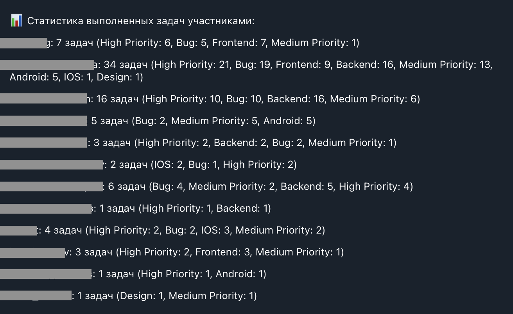

# Проект Telegram Trello бот: управление задачами и аналитика

Проект Telegram бота представляет собой инструмент для управления задачами и получения аналитики по сотрудникам.
Бот позволяет отслеживать список задач и анализировать статистику выполнения задач для каждого сотрудника.

## Особенности

- **Отслеживание задач:** Просматривайте список задач в любое удобное время через Telegram.
- **Отслеживание статистики:** Получайте статистику о выполненных задачах для каждого сотрудника.
